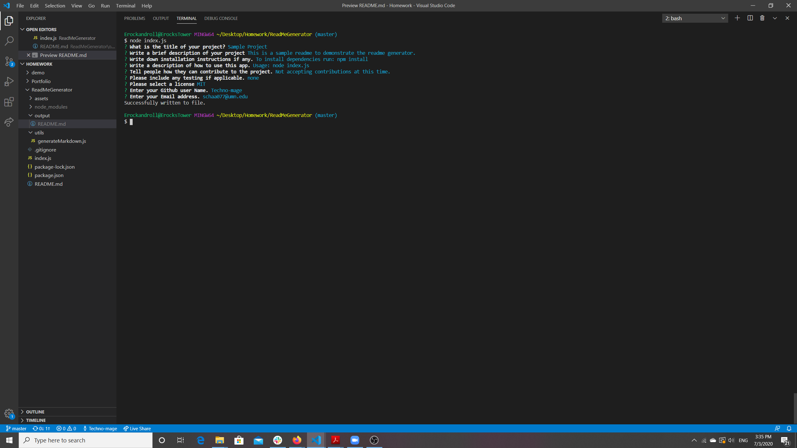

# ReadmeGenerator

## Description

* This is a node.js command line application which will generate a Maked up README file based on user input.

## Installation

* to install the required dependencies run

    ```
    npm install
    ```

## Usage

* to run this application

    ```
    node index.js
    ```
* This application will then prompt the user for for the values to be filled in the readme Generator



* After the user finishes the prompts, the generator will create an "output" folder, and will write the readme file to that folder. 


## Demo Video

* A video walkthrough has been provided, you can find it in https://drive.google.com/file/d/15gR0Xm7yoagoyDecTrCj9FpindwK14LE/view?usp=sharing

 